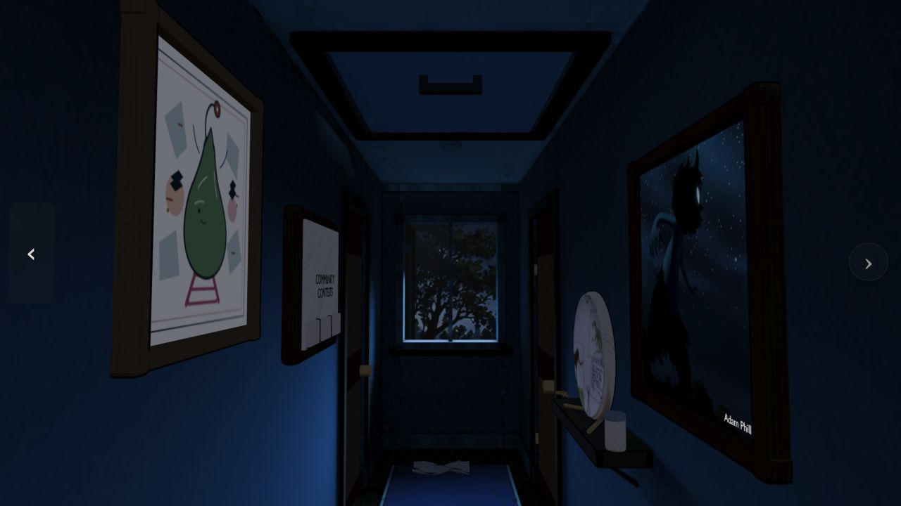
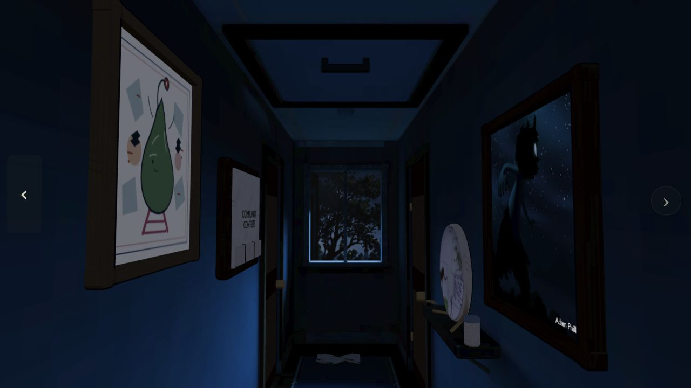
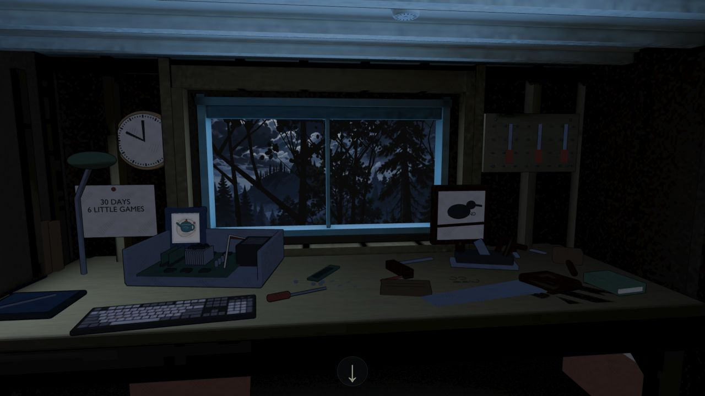
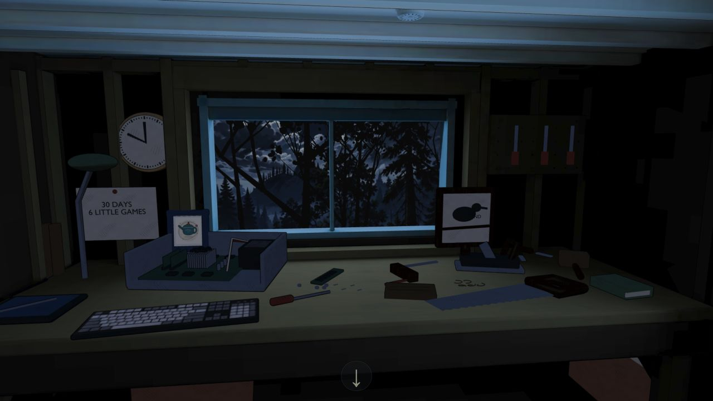
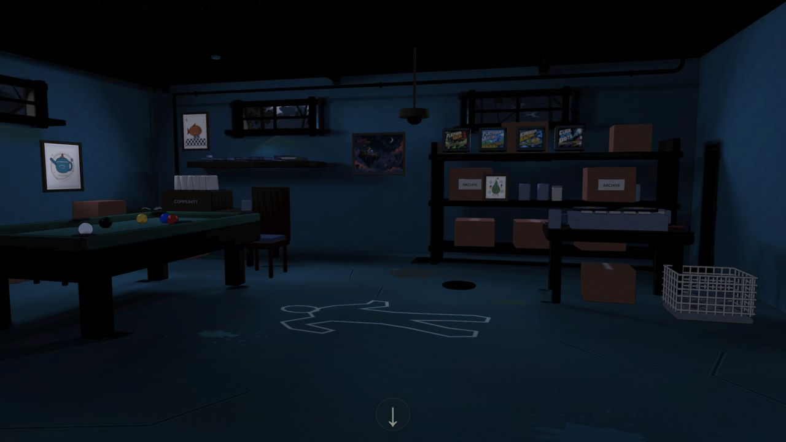
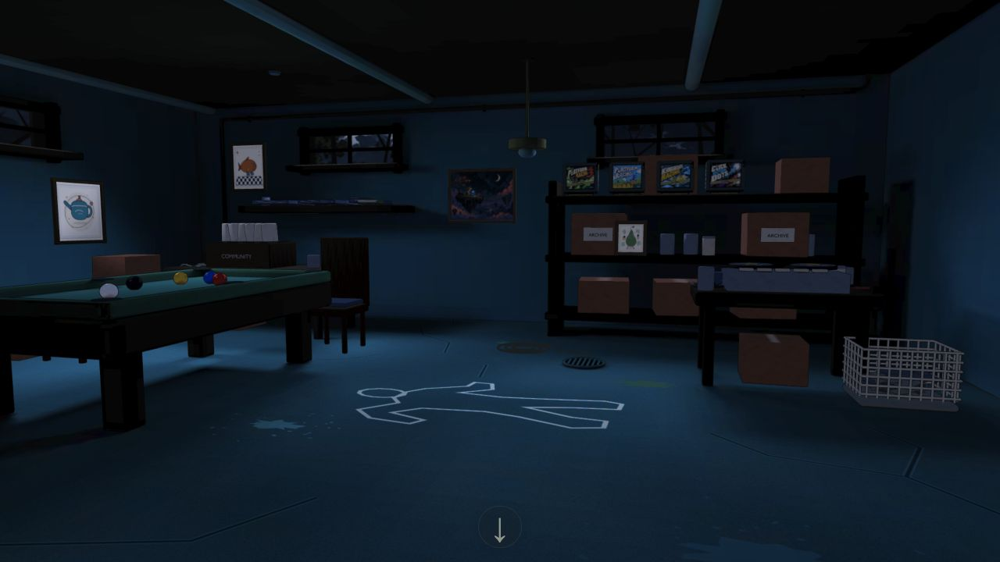
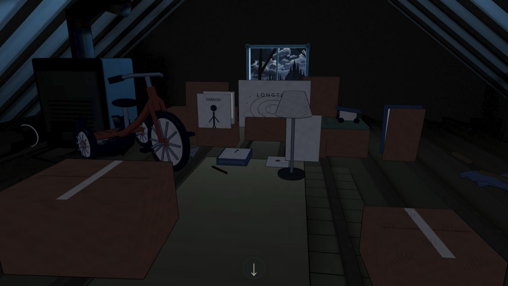
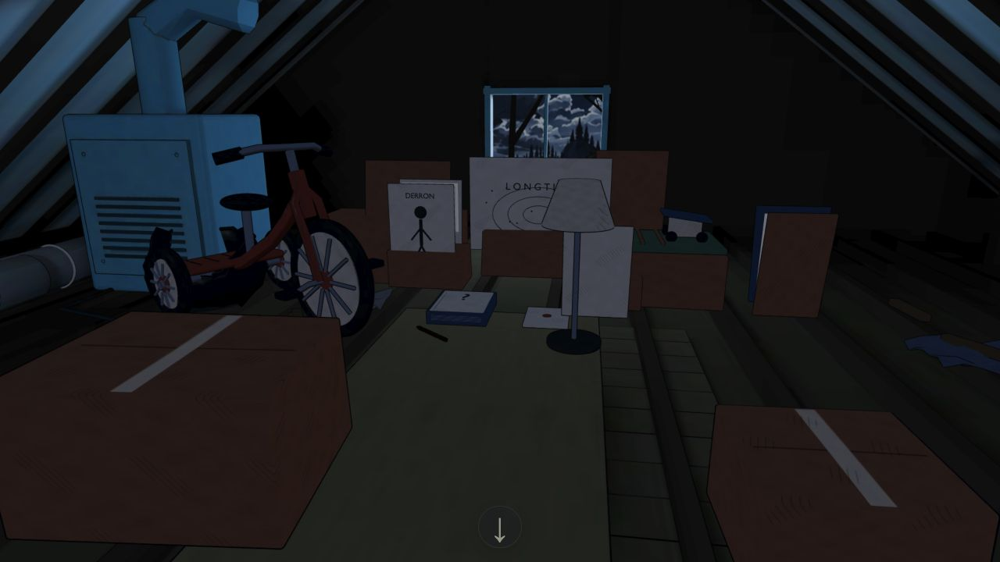

# Full-house atlas refresh

The den retains its original seated projection. The hallway, workshop, basement,
attic, and connective structure use refreshed static surface atlases with the
original materials and moonlit window lighting. The rejected illustrated hallway
experiment remains optional and is not the default.

The bake restores source UVs before assigning new atlas UVs. Signed object names
are preserved when matching source geometry, preventing left/right mismatches.
The hallway window wall and its trim now belong to the hallway bake. Irradiance
and albedo are baked separately; only irradiance is denoised, so the filter does
not smear surface artwork and grain. Bake outputs are lossless PNG/EXR. Geometry,
transforms, and the source pixels of live props and artwork remain intact.

Visual review caught blocked cellar light: its window backdrops sit on opaque
masonry rather than cut openings. The window spill emitters now start just inside
the sills. Their direction, blue color, and power remain moonlight from the
windows. The reviewed basement ceiling paint is restored from its source
material. No new cozy interior lamps are added.

## One delivery set

`npm run build` produces one shared GLB set for every browser. There are no phone
variants, viewport-selected asset URLs, or runtime canvas texture reductions.
The build reads the lossless masters, sizes each atlas to its shared delivery
limit, then performs the only lossy encoding step: quality-80 WebP. Important
hall wall/floor, workshop, basement, and garage trim atlases have a 2048-pixel
limit; other atlases have a 1024-pixel limit. These delivery limits apply to
desktop and phone browsers equally. They reduce resolution in the delivery set;
they do not change the full-resolution bake masters. Live artwork keeps its
original image dimensions. Atlas UVs use 18-bit Draco precision.

The five shared release models total 7.95 MB. The 22 delivered atlas base levels total 38.01 million pixels (about 203 MB of
RGBA GPU storage including mipmaps). This excludes the den, live artwork,
geometry, and browser overhead. Phone-size viewport testing is a layout/render
check on the desktop browser, not a test on physical phone hardware.

## Review captures

Before captures show the previous default release. After captures show the
shared production build, rather than lossless source preview assets.

| Room | Before | After |
| --- | --- | --- |
| Hallway |  |  |
| Workshop |  |  |
| Basement |  |  |
| Attic |  |  |

The moving hatch and small smoke-detector lightmaps retain their reviewed
historical bake and provenance; they were not folded into static surface atlases.
The lossless refresh stages in `scene/exports/house-release/atlas-refresh`.
Cloud result reports are referenced by `layout.json` and remain under `.runpod`.

Validation covers source mapping, geometry and live artwork preservation,
lossless masters, the shared production texture budget, a clear light path at
each cellar window emitter, and visible illumination on the cellar walls.

## Cloud run

The accepted full bake used an RTX PRO 6000 Blackwell Workstation Edition with
OptiX, Blender 4.5.14 LTS, 128 samples, 976 receivers, and 22 atlas groups.
Its Blender recipe took 495.9 seconds (8m16s), excluding machine setup and
result transfer. The accepted run cost an estimated $0.4027; the earlier visual
check run cost $0.321. Total estimated spend was $0.7237 against the approved
$5 cap. Both temporary machines were deleted and deletion was confirmed.
The workloads differ from the previous A5000 experiments, so these numbers do
not establish a measured 4× speedup.

Final validation: production build succeeds; 220 JavaScript tests pass with one
superseded byte-for-byte test skipped; all 24 Runpod tests pass. The geometry
clearance check also passes. No deployment was performed.

Phone-size captures: [basement](basement-phone.jpg) and [attic](attic-phone.jpg).
The final production preview is available locally at `http://127.0.0.1:8002/`.
