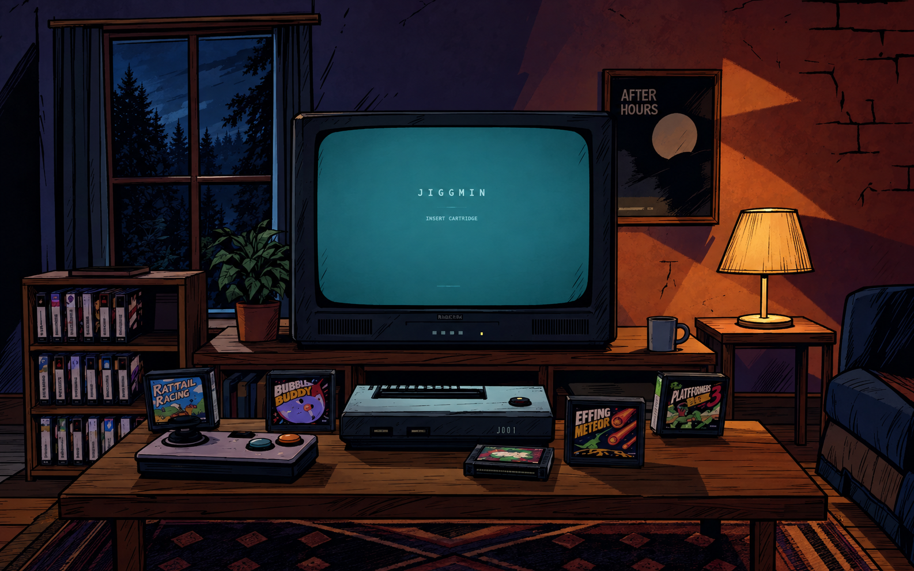
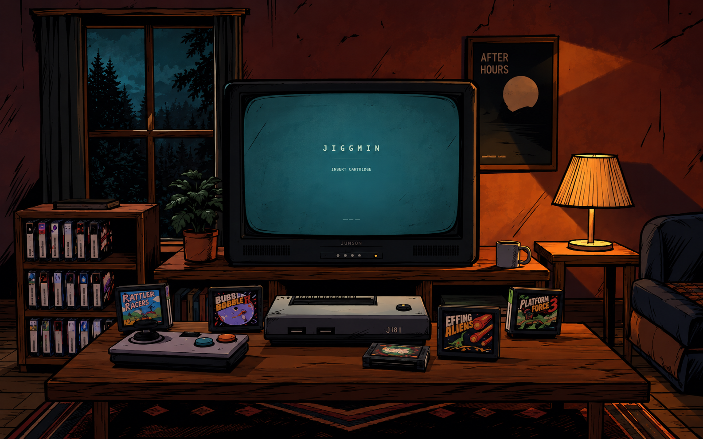
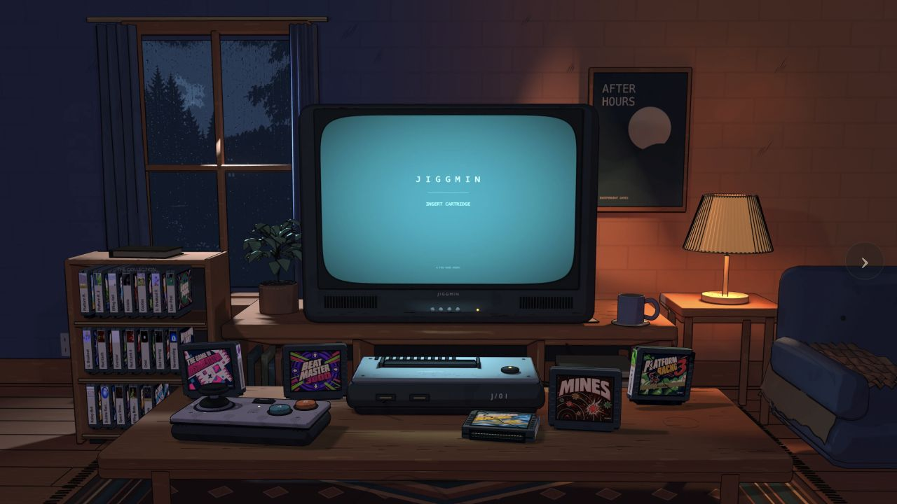

# Den art-direction study

Selected target: **B — Midnight ink**. Generated using the built-in image generator
from a fresh screenshot of the working site, with the user's Wolf Among Us image
as the style reference. The exact [prompt set](prompts.md) is retained.

| Direction | Assessment |
| --- | --- |
| A — Amber noir | Strong ink and warm atmosphere, but the nearly all-warm room weakens the window/CRT contrast. |
| B — Midnight ink | Better warm/cool separation, clearer teal focal point, and useful selective hatching. Chosen as the reference for subsequent Blender renders. |

## B — Selected reference

## A — Alternate

## Applying the reference

- Indigo/plum shadows blending gradually into an amber right wall, with stronger lamp spill and subtle painted-over brick courses across the whole wall.
- A bright teal CRT with the original text and game presentation.
- Strong silhouettes and selective, tapered interior strokes.
- Warm, simplified wood with drawn wear; avoid evenly scattered texture patches.
- Keep furniture, interactions, and actual cartridge artwork. The generated labels
  and incidental changes to architecture are not instructions or production assets.

The native implementation is in `scene/scripts/den_ink_materials.py`,
`scene/scripts/illustrate_den.py`, and `web/den-illustration.js`.

## Reference-guided browser render

[Phone view](site-after-phone.png). The render follows the selected palette,
lighting hierarchy, ink weights, and surface treatment while keeping the original
scene and game artwork. It is an interpretation of the concept, not a pixel match.

Validation: all 86 automated tests pass; desktop and 390 × 844 browser views,
cartridge motion, prop reactions, and the game play view were checked.

The latest user-directed refinement restores the blue-to-orange wall gradient with
a gradual transition, increases warm lamp light, and adds faint, softened brick joints beneath the same paint color
across the entire wall. The artificial orange triangles remain removed. The left shelf's
bottom-right four spaces are excluded from placement and automatic returns.
