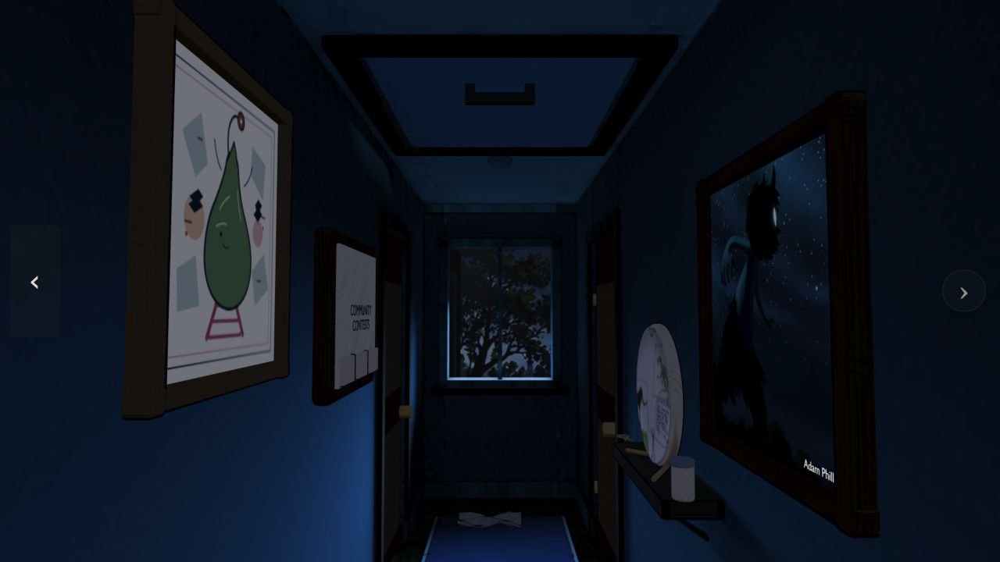
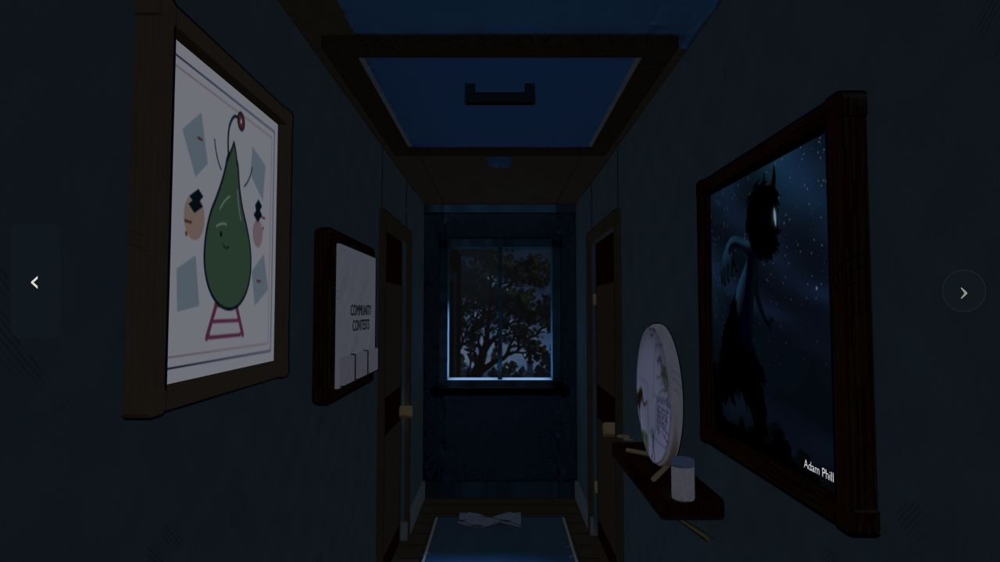

# Moonlit illustrated hallway experiment

Status: full-resolution Runpod bake completed on 2026-10-01, merged into the
optional browser experiment, and ink transferred into six of the seven atlases.
The RTX A5000 worker took 742 seconds; total estimated cost was $0.0712. Pod
deletion was confirmed. All 311 receiver meshes and 18,192 source UV corners
were mapped. The small smoke-test atlases are not deliverables.

The den stays on its original projection. This hallway experiment retains the
existing blue window-light rig and excludes warm practicals. Toon diffuse
shading (size .58, smooth .035) replaces glossy/normal-map response on fixed
hallway surfaces. A cool material fill preserves shadow readability. Sparse
world-space diagonal hatching adds drawn surface detail.

`preview.png` is a 16-sample Blender material preview. Live picture frames and
interactive props use the runtime's separate illustration treatment, so their
preview shading is not a precise browser reference. Window scenery is also a
runtime element. The final browser comparison is `before.jpg` and `after.jpg`.

## Resolution audit

The existing structure-hall atlas is a 4096 × 4096 PNG. The original hallway
furnishing atlas is a 4096 × 4096 JPEG, already lossy before the site build.
Production normally encodes both as quality-80 WebP without resizing. The runtime
also reduces 4K lightmaps to 2048 on compact devices.

The experiment allocates six 4096 × 4096 atlases (north walls, south walls,
ceiling, floor, trim, runner) and one 2048 × 2048 furnishing atlas. New bakes come
from native Blender reflectance, never from already-lit source textures.
Authored source UVs are restored/interpolated; structural primitives without
authored UVs get metre-scale planar finish coordinates.

The merger preserves interactive object ownership, hierarchy, transforms and
separate artwork. `texture_pixel_exact` requests lossless WebP at unchanged
dimensions, disables automatic compact-device resizing, increases UV precision
to 18 bits, and enables anisotropic sampling. It cannot restore information
already lost in older source artwork encodings. The build test compares decoded
texture pixels, not merely file sizes or dimensions.

## Commands

```sh
/Applications/Blender.app/Contents/MacOS/Blender -b scene/house-release.blend --python scene/scripts/bake_hallway_style.py -- --preview
/Applications/Blender.app/Contents/MacOS/Blender -b scene/house-release.blend --python scene/scripts/bake_hallway_style.py -- --smoke
```

The approved full GPU recipe uses `--target hallway-style`. Merge the
verified result, add projected ink after filtering, then build and validate:

```sh
node scene/scripts/prepare_hallway_style.mjs <verified-output>/hallway-style.glb
node scene/scripts/transfer_hallway_ink.mjs --style
npm run build
node --test tests/hallway-style-resolution.test.mjs
```

The optional browser path is `?hallwayStyle=illustrated`; its full-resolution
assets are installed. The ordinary hallway remains the default. The production
build passed all 214 JavaScript tests, including exact decoded color-pixel checks
for the seven atlases and separate artwork; 23 cloud-runner tests also passed.
The new assets total about 43.9 MB after lossless color compression, so this
quality experiment trades additional download/GPU memory for detail.

Picture assemblies retain their individual meshes: batching their shallow
backing/contour geometry hid the separate artwork plane in the new asset layout.
The den remains on its original projection. This test covers the hallway only;
other rooms retain their existing appearance.

Browser verification: hallway entry, rear-hall travel, and return succeeded with
no console errors. Artwork remained visible after the batching adjustment; the
five prop cleanup/batching tests were rerun and passed.

| Before | Illustrated experiment |
| --- | --- |
|  |  |
