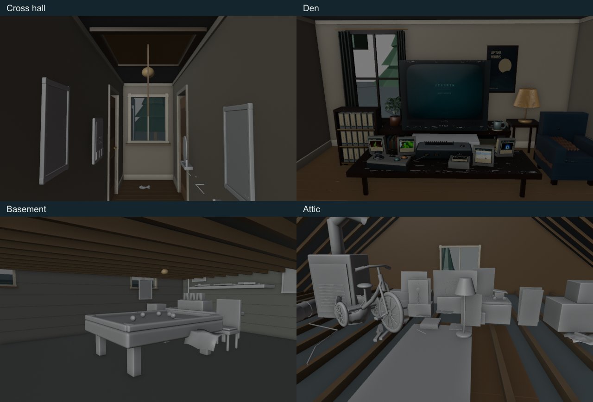

# Camera-path finishing — completion record

All seven passes from the visibility gap analysis are implemented in the editable house preview. Production room files and the live house remain separate. Bedrooms, bathroom and kitchen interiors remain reserved behind closed doors, as scoped in the audit.

| Order | Completed work |
| --- | --- |
| 1. Camera motion | Upright, passage-following camera orientation; the den turns through its doorway toward the TV. Basement descent follows the stair and holds height over the landing. Attic ascent looks into the room, centres within the hatch, then clears the floor before turning toward the ridge. |
| 2. Cross hall and entry | Continuous floorboards, skirting/cornice, door casing and thresholds, window frames/mullions/sills/glass, opal lighting, coat bench and hooks; hallway decorations checked against the basement entrance. |
| 3. Mudroom and basement connection | Laundry floor/counter/appliances/shelf, garage threshold and frame, stair risers/stringers, handrails, centre guard, lower side enclosure and landing lighting. |
| 4. Attic access | Lined and trimmed ceiling aperture, three-section folding ladder with hinges, opening hatch and pull cord, landing rail and light. Main roof rise increased to 4.5 m (9:12 pitch, ridge Y=7.3) to give the shifted access more room. |
| 5. Existing room shells | Garage joists/studs/windows/lighting; basement masonry joints, overhead joists, high windows and utility lights; attic rafters, joists, boarded strip, gable windows and attached conduit. Legacy high attic runs that no longer fit the roof were removed. |
| 6. Den and visible exteriors | Approved west-wall composition retained. Original den colours and image artwork restored to the fast export with simplified PBR shaders, warm/cool lights, floor and trim. Added nearby trees, porch structure and window-well context for views outside. |
| 7. Rear hall and review | Finished corridor floor, trim, fixtures, end window and closed room entrances. Added door panels and hardware; enabled the labelled rear-hall view. Desktop, 4:3 and portrait compositions reviewed, plus travel/return checks. |

## Verification

- 17 tests cover existing house routes/camera behavior, proposal apertures, zero-roll camera motion and retained endpoint views, hinge invariants, and connected ladder sections throughout folding.
- Exported-mesh audit samples 800 segments per path: no structural, prop or animated-access camera crossings on the final routes.
- Additional sampled clearance checks probe a 44 cm wide envelope at eye, mid-body and lower-body heights and 16 cm above the eye. These found and drove the stair-landing and attic-exit corrections. The final checks are clear. They are discrete geometric probes, not a full character physics solver.
- All three hall targets remain inside 16:10, 16:9, 4:3 and portrait frames. Portrait was inspected with the production lens-resize behavior; all three buttons remain separately visible. The basement target still uses a partially oblique doorway view.
- The final material export is approximately 67 MB and 10 seconds on this machine, excluding Blender startup. No lighting bake or production build was run.
- Full travel uses the same progress parameter for position, door hinges and ladder folding; returning reverses those states. Browser playback, endpoint state, screenshots and console checks supplement the mesh audit.

The fast viewer is a finished layout/visibility preview, not the final production renderer. Most reused non-den props remain clay shaded. The den's original Cycles/Freestyle shading is approximated by source-colour PBR materials and retained image textures; its production artwork is untouched. Final production lighting/export integration is a separate task.

## Review and edit

- Preview: http://127.0.0.1:8010/scene/preview/
- Native scene: `scene/house-plan-preview.blend`
- Finishing collections: `06 Finish 2` through `06 Finish 7`
- Camera and mechanism code: `scene/preview/travel-camera.js`, `scene/preview/access-animation.js`
- Reproducible finishing passes: `npm run preview:house:finish -- --stage N` (2–7)
- Re-export saved Blender edits: `npm run preview:house:export`
- Verify geometry: `npm run preview:house:check`
- Generate current render samples: `npm run preview:house:sample`, then run `scene/scripts/render_house_audit.py` in Blender with the saved preview open.

A before-pass `.blend` backup is retained for each finishing stage. Diagnostic frames are under `scene/renders/house-preview/finished/`; generated mesh/check metadata is under `scene/preview/generated/`.

